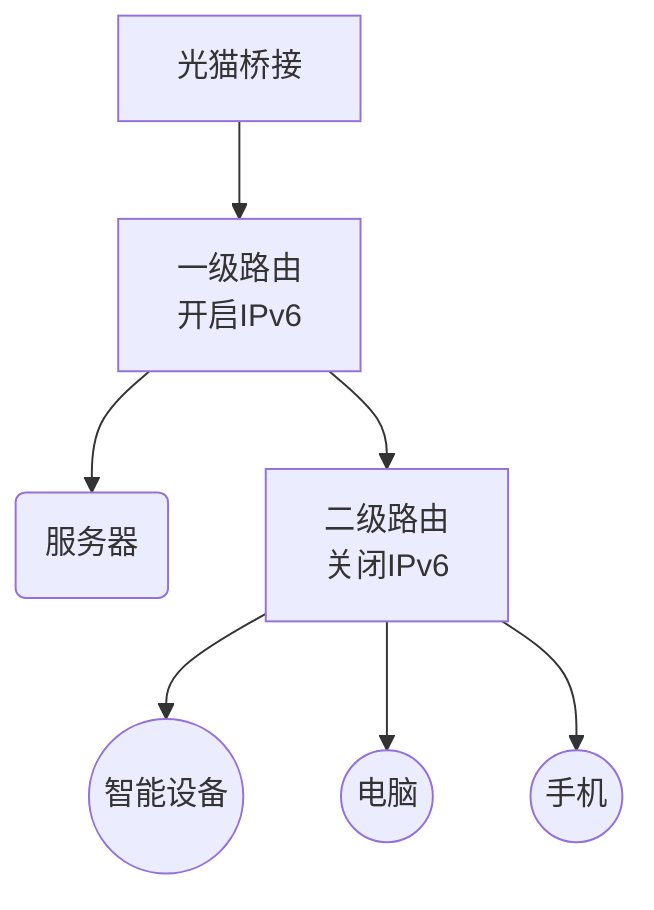

## 1. 背景

随着影像画质提升（照片从KB级增至MB级，电影从1080P迈向4K），个人数据量激增。尽管可通过扩容硬盘/手机存储数据，但跨设备传输效率低下。因此，搭建个人服务器实现集中存储与共享，正成为高效解决方案。

**是什么**：

个人服务器可以是专业服务器或云服务器，也可以是一台电脑，一台NAS（网络附属存储），一个N1盒子，但凡是可以连接网络，并且满足我们日常需求的智能设备，都可以称为个人服务器。

**为何选择在本地搭建：**

| —   |              自建服务器               |            云服务器            |
| --- | :------------------------------: | :------------------------: |
| 优点  |        价格便宜、自由购买配件、可拓展性强         | 有公网IP、装系统方便、新人价格便宜、有客服保障售后 |
| 缺点  | 可能无公网IP、自付电费、噪声大，占空间、 出现问题需要自己解决 |     续费价格高、配置低，升级配置价格高昂     |

## 2. 机器选择

企业级服务器、成品NAS、DIY主机、低功耗主机

**企业级服务器**：如机架式服务器、刀片式服务器，市面上比较常见的有Dell、惠普、华为、中兴品牌。

专业的服务器主机，有更加专业的服务器管理系统，还有硬件设备生产就是为了当成服务器来使用的，所以不用太担心服务器的兼容性问题，还有寿命问题，这类机器一般没这么容易坏，可拓展性强，主板上插口一般都比较丰富，可以根据自己的需求拓展各种配件。

一般这类的机器功耗高噪音比较大，耗电也高，一般会配合机柜一起使用，占用空间大。

**成品NAS**：市面上常见品牌有群晖、威联通、铁威马、绿联、极空间等。

好的NAS，品牌生态也比较好，配套软件做的非常好，系统上手比较容易，小白入门玩一下基本就可以熟悉整个系统的玩法了。

不同品牌功能上有所不同，有的功能需要收费，不同机型功耗不同。

**个人DIY主机**：说是DIY，其实只是区别于市面上的昂贵成品机器，淘汰的洋垃圾也在DIY的范畴里面。

可以根据自己需要进行搭配，适合家里有闲置老式电脑，对低功耗有要求的。

需要自己装系统、软件，对个人计算机方面能力要求高。

**低功耗主机**：这类产品主要是一些工控机，或者是成品小主机，体积小、功耗低，只有几瓦。

拓展性差，稳定性差。

### 2.1. 个人组装优势

✅ **硬件自由搭配**：按需选择低功耗CPU（如Intel T系列）、ECC内存

✅ **扩展性强**：自由添加硬盘、GPU、PCIe设备

✅ **成本可控**：二手硬件（如退役服务器配件）可降低50%+成本

✅ **技能提升**：深度理解硬件架构、操作系统及网络原理

## 3. 如何搭建

### 3.1. 网络配置

开启IPv6，选择支持IPv6的路由器

光猫改**桥接模式**，路由器拨号（提升NAT性能）

一级路由器配置静态路由规则，局域网设备通过局域网IP访问服务器，二级路由关闭IPv6，保护家庭智能设备防止暴露于公网。



### 3.2. 硬件配置

#### 3.2.1. 个人配置

**CPU**：Intel i3-4160，低功耗+核显，无需独立显卡

**内存**：DDR3 8GBx2

**硬盘**：SSD 120GB（系统盘）+ HDD 1TB，兼顾速度与数据安全

**其他**：智能插座，实现来电自启，定时开机

### 3.3. 系统安装与分区

**推荐系统**：**Ubuntu 22.04 LTS**（长期支持版，社区资源丰富）

低于此版本导致有些软件无法安装

**其他系统：**

- Debian：更轻量，适合老硬件
- Windows：操作方便，需要桌面支持
- OpenMediaVault：专注NAS场景

**文件系统格式：**

- EXT4：Linux最常用的文件系统，稳定可靠
- Btrfs：更新的，现代的，开源的文件系统，支持快照、压缩、数据校验
- NTFS: 与Windows兼容（需要额外驱动）

**分区方案**（示例：120G + 1T）

| 分区    | 推荐大小       | 实际使用 |
| ----- | ---------- | ---- |
| /boot | 1G         | 300M |
| /tmp  | 5G         | 30M  |
| /     | 100G（剩余空间） | 56G  |
| swap  | 8G         | 1G   |
| /home | 1T         |      |

/var 和/usr推荐单独分区，var目录实际使用42G（docker overlay2 33G），usr目录实际使用12G

**/boot** 是存放操作系统内核和启动过程中所需文件的地方。这个分区的存在对于系统的启动至关重要，尤其是在主要的根分区出现问题时，有了单独的boot分区，计算机仍然能够启动。因此，合理规划boot分区的大小对于系统的稳定运行非常重要。

**/tmp** 用来存放临时文件。这对于多用户系统或者网络服务器来说是有必要的。这样即使程序运行时生成大量的临时文件，或者用户对系统进行了错误的操作，文件系统的其它部分仍然是安全的。因为文件系统的这一部分仍然还承受着读写操作，所以它通常会比其它的部分更快地发生问题。这个目录是任何人都能访问的，所以需要定期清理。

**/var** 目录主要用于存储系统运行过程中动态变化的数据文件。`/var/lib/docker`是docker默认安装位置，若使用docker较多会导致此位置占用大量空间。

### 3.4. 软件配置

#### 3.4.1. 基础软件配置

##### 3.4.1.1. ssh

修改默认端口、禁用密码登录

配置登录通知：编辑`/etc/pam.d/sshd`，添加：

```text
session optional pam_exec.so /usr/local/bin/notify.sh  
```

（`notify.sh` 脚本调用邮件服务发送登录告警）

##### 3.4.1.2. vpn：tailscale

- **原理**：基于WireGuard的加密点对点VPN
- **核心功能**：
  - **Subnets**：将服务器暴露给Tailscale网络内的设备
  - **Exit Nodes**：设备流量通过服务器出口访问公网
  - **MagicDNS**：`your-server.tailnet.ts.net` 直接访问 `your-server`
  - **Send Files**：


##### 3.4.1.3. 服务器面板：1Panel

**对比宝塔的优势**：

- 现代化UI设计，界面整洁、无广告，付费功能可隐藏
- 容器化部署，所有服务基于Docker，隔离性强，卸载无残留
- 开源透明，无需绑定手机号，支持匿名使用
- 资源占用低，约200MB内存
- 开源社区活跃，更新频繁

1Panel在**开源透明性**、**使用体验**、**轻量化性能**、**容器化部署**及**隐私保护**方面优于宝塔，尤其适合技术驱动型用户和新兴技术场景。而宝塔凭借**功能成熟度**、**多系统支持**（含Windows）和**丰富插件生态**，更适合传统运维需求。

##### 3.4.1.4. WAF：雷池

- **开箱即用**：一键阻断SQL注入/XSS攻击等
- **低侵入性**：反向代理模式部署，基本无需改应用代码
- **可视化报表**：实时攻击地图、威胁类型统计

### 3.5. 域名与证书配置

#### 3.5.1. 购买域名

阿里云、腾讯云购买域名，新人1元，`.top`、`.xin` 首年12元，续费30多

cloudflare托管，提供多种免费服务

免费三级域名，缺点：名称长，解析慢

#### 3.5.2. ddns

| **工具**      | **特点**                |
| :---------- | :-------------------- |
| **ddns-go** | 单文件运行，支持30+服务商        |
| **Lucky**   | 集成STUN内网穿透、SSL证书申请    |
| **自写脚本**    | 用Cloudflare API定时更新IP |

#### 3.5.3. acme.sh安装证书

**优势**：

- 支持多域名（含通配符证书）

- 自动续期（cron定时任务）

- 一键部署到Nginx/Apache

- 提供多种通知方式（邮件、QQ、钉钉）

### 3.6. 邮件通知配置

为服务器配置通知方式非常重要，有利于故障快速响应（避免业务中断）、风险预警（防患未然）、自动化处置（减少人工介入）

通知方式有多种选择，有邮件、短信、QQ、钉钉等通知方式，其中最简单的就是邮件通知

#### 3.6.1. 配置方式

- 使用网易、QQ邮箱的SMTP服务
- 使用第三方邮件服务：mailgun、brevo
- 自建邮件服务器

## 4. 推荐链接

[Ubuntu20.04 安装 - Kyon-H Blog](https://blog.kyon.xin/2024/11/02/Ubuntu20.04%E5%AE%89%E8%A3%85/)

[SSL证书安装 - Kyon-H Blog](https://blog.kyon.xin/2025/04/02/SSL%E8%AF%81%E4%B9%A6%E5%AE%89%E8%A3%85/)

[qBittorrent 安装 - Kyon-H Blog](https://blog.kyon.xin/2024/12/12/qBittorrent%E5%AE%89%E8%A3%85/)

[Minecraft 服务器安装 - Kyon-H Blog](https://blog.kyon.xin/2024/11/16/Minecraft%E6%9C%8D%E5%8A%A1%E5%99%A8%E5%AE%89%E8%A3%85/)
